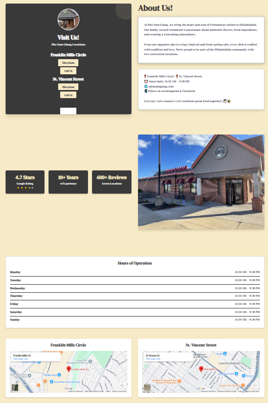
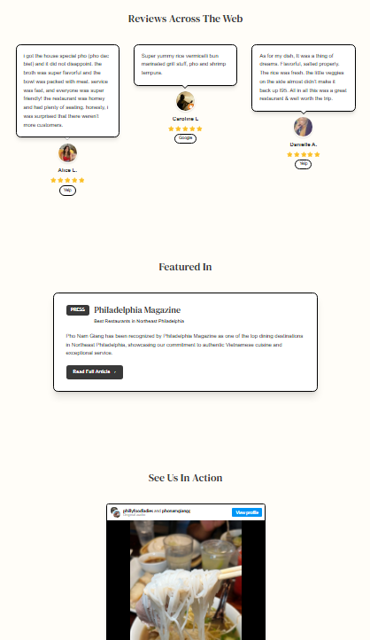
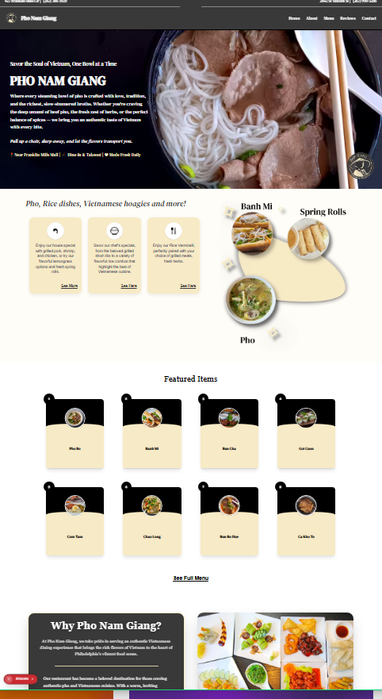
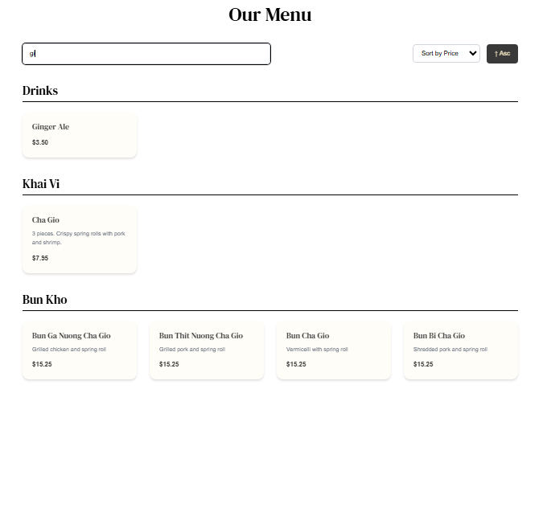

# 🍜 Pho Nam Giang - Restaurant Website
**🌐 Live Site:** [phonamgiangsite.vercel.app](https://phonamgiangsite.vercel.app/)

A modern, responsive restaurant website built with Next.js for Pho Nam Giang, an authentic Vietnamese restaurant located near Franklin Mills Mall in Philadelphia, PA.


## 🌟 Features

- **Responsive Design** - Fully optimized for mobile, tablet, and desktop viewing
- **Modern UI/UX** - Clean, professional design with smooth animations
- **Interactive Menu** - Showcasing authentic Vietnamese cuisine with high-quality images
- **Reviews System** - Integration with Google, Yelp, and Grubhub reviews
- **Social Media Integration** - Embedded Instagram posts and reels
- **Contact Form** - Functional contact form with email integration via Web3Forms
- **Location Information** - Easy-to-find contact details and hours of operation


## 🛠️ Tech Stack

- **Framework:** [Next.js 14](https://nextjs.org/) (React)
- **Styling:** [Tailwind CSS](https://tailwindcss.com/)
- **Icons:** [Lucide React](https://lucide.dev/)
- **Image Optimization:** Next.js Image Component
- **Fonts:** DM Serif Text
- **Email Service:** [Web3Forms](https://web3forms.com/)

## 📁 Project Structure

```
pho-nam-giang/
├── components/
│   └── Home/
│       ├── navbar.jsx
│       ├── hero.jsx
│       ├── info-one.jsx
│       ├── info-two.jsx
│       ├── info-three.jsx
│       ├── info-four.jsx
│       ├── menu-card.jsx
│       ├── socialMedia.jsx
│       └── footer.jsx
├── app/
│   ├── page.jsx
│   ├── reviews/
│   │   └── page.jsx
│   ├── contact/
│   │   └── page.jsx
│   └── layout.jsx
├── public/
│   └── Images/
│       └── Home/
├── Styles/
│   └── Home.css
└── README.md
```

## 🚀 Getting Started

### Prerequisites

- Node.js 18.x or higher
- npm or yarn package manager

### Installation

1. Clone the repository
```bash
git clone https://github.com/yourusername/pho-nam-giang.git
cd pho-nam-giang
```

2. Install dependencies
```bash
npm install
# or
yarn install
```

3. Set up environment variables (if needed)
```bash
cp .env.example .env.local
```

4. Run the development server
```bash
npm run dev
# or
yarn dev
```

5. Open [http://localhost:3000](http://localhost:3000) in your browser


## ⚙️ Configuration

### Contact Form Setup

To enable the contact form functionality:

1. Sign up at [Web3Forms](https://web3forms.com)
2. Get your access key
3. Replace `YOUR_ACCESS_KEY_HERE` in `/app/contact/page.jsx` with your actual key
4. Update the email address to your preferred contact email

### Customization

- **Colors:** Modify Tailwind colors in `tailwind.config.js`
- **Images:** Replace images in `/public/Images/Home/`
- **Menu Items:** Update menu data in menu components
- **Contact Info:** Edit contact details in the contact page

## 📄 Pages

### Home Page
- Hero section with restaurant introduction
- Featured dishes and specialties
- Social media highlights
- Call-to-action sections

### Reviews Page
- Customer testimonials
- Platform reviews (Google, Yelp, Grubhub)
- Press features (Philadelphia Magazine)
- Instagram and social media embeds

### Contact Page
- Contact form with validation
- Location and hours information
- Direct contact methods (email, phone)
- Map integration placeholder



## 🎨 Design Features

- **Typography:** DM Serif Text for headings, modern sans-serif for body
- **Color Scheme:** Warm, inviting colors reflecting Vietnamese cuisine
- **Animations:** Smooth fade-in effects and hover transitions
- **Accessibility:** Semantic HTML and ARIA labels
- **Performance:** Optimized images with Next.js Image component

## 📱 Responsive Breakpoints

- **Mobile:** < 768px
- **Tablet:** 768px - 1024px
- **Desktop:** > 1024px

## 🔧 Scripts

```bash
# Development
npm run dev

# Build for production
npm run build

# Start production server
npm start

# Lint code
npm run lint
```

## 📸 Screenshots

### Desktop View


### Mobile View


### Menu Section


## 🤝 Contributing

Contributions, issues, and feature requests are welcome! Feel free to check the [issues page](https://github.com/yourusername/pho-nam-giang/issues).

## 📝 License

This project is [MIT](LICENSE) licensed.

## 👨‍💻 Developer

**Alan Grissette**
- Email: alangrissette02@gmail.com
- GitHub: [@yourusername](https://github.com/yourusername)

## 🙏 Acknowledgments

- Pho Nam Giang restaurant for the opportunity
- Next.js team for the amazing framework
- Tailwind CSS for the utility-first CSS framework
- All customers who provided reviews and testimonials

## 📞 Contact

For business inquiries or support:
- **Restaurant Location:** Near Franklin Mills Mall, Philadelphia, PA
- **Email:** alangrissette02@gmail.com
- **Hours:** Daily 10:00 AM - 9:00 PM

---

Made with ❤️ and 🍜 for Pho Nam Giang
